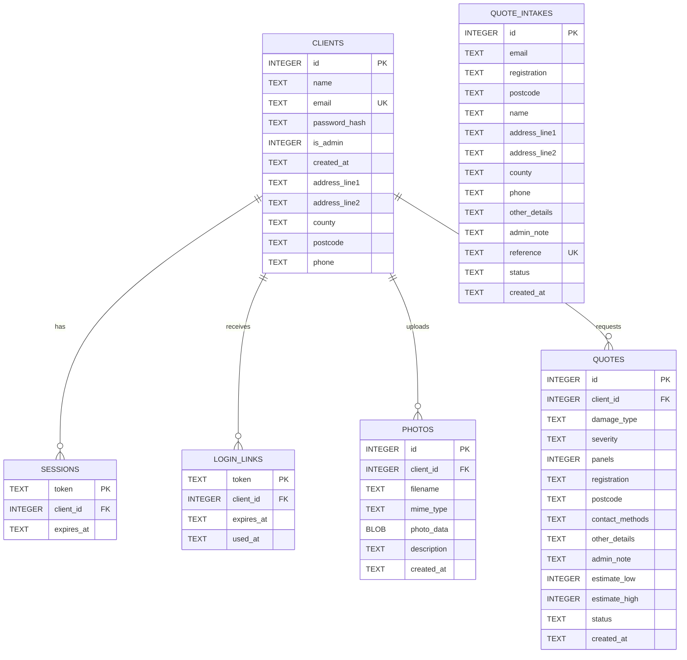

# Database Schema Diagram

```mermaid
erDiagram
    CLIENTS {
        INTEGER id PK
        TEXT name
        TEXT email UK
        TEXT password_hash
        INTEGER is_admin
        TEXT created_at
        TEXT address_line1
        TEXT address_line2
        TEXT county
        TEXT postcode
        TEXT phone
    }

    SESSIONS {
        TEXT token PK
        INTEGER client_id FK
        TEXT expires_at
    }

    LOGIN_LINKS {
        TEXT token PK
        INTEGER client_id FK
        TEXT expires_at
        TEXT used_at
    }

    PHOTOS {
        INTEGER id PK
        INTEGER client_id FK
        TEXT filename
        TEXT mime_type
        BLOB photo_data
        TEXT description
        TEXT created_at
    }

    QUOTES {
        INTEGER id PK
        INTEGER client_id FK
        TEXT damage_type
        TEXT severity
        INTEGER panels
        TEXT registration
        TEXT postcode
        TEXT contact_methods
        TEXT other_details
        TEXT admin_note
        INTEGER estimate_low
        INTEGER estimate_high
        TEXT status
        TEXT created_at
    }

    QUOTE_INTAKES {
        INTEGER id PK
        TEXT email
        TEXT registration
        TEXT postcode
        TEXT name
        TEXT address_line1
        TEXT address_line2
        TEXT county
        TEXT phone
        TEXT other_details
        TEXT admin_note
        TEXT reference UK
        TEXT status
        TEXT created_at
    }

    CLIENTS ||--o{ SESSIONS : has
    CLIENTS ||--o{ LOGIN_LINKS : receives
    CLIENTS ||--o{ PHOTOS : uploads
    CLIENTS ||--o{ QUOTES : requests
```
